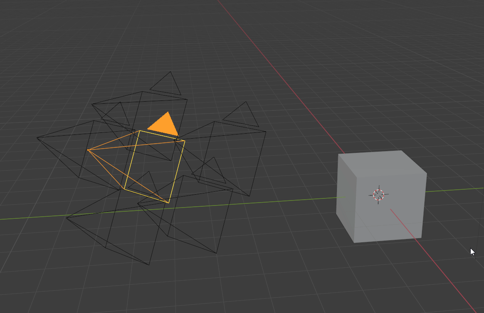
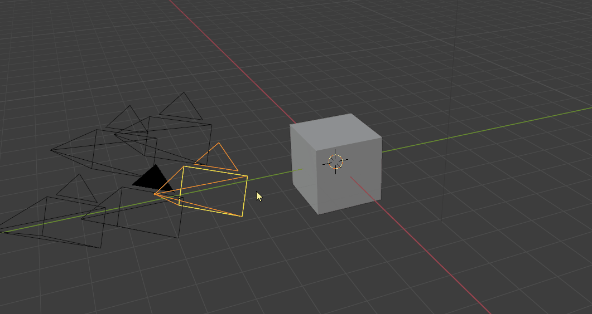

# CameraManager

Camera Manager is an addon to improve efficiency and organization working with cameras in static scenes. It does not provide specialized tools for animations.
The addon includes different overview panels (3D view and Scene properties), a pie menu for quickly adjusting settings on the active camera, and different tools to associate resolution and world materials to specific cameras.

### Toggle Cameras (CTRl + Left/Right Arrow)
Ctrl + Left/Right Arrow allows you to quickly toggle between the scene cameras. All camera-specific settings like resolution and world material will automatically be applied.
Note: All camera-specific settings, offered by this addon, like world material and resolution will not be updated when changing the active camera in the scene properties manually. Use the hotkeys and buttons provided by the addon.

Resolution is stored for each camera.

Having different camera resolutions makes the work with different image planes much easier. You can quickly toggle between the cameras without changing the scene settings every time you change the camera.

### The Camera Overview (Ctrl + Shift + C)

This menu lists all cameras in your scene. It provides a quick overview of the most important settings and a quick way of adjusting them.

Features
<ol>
    <li>Change to camera</li>
    <li>Rename the camera</li>
    <li>Toggle visibility, selection and locking for the camera</li>
    <li>Adjust focan lenght</li>
    <li>Camera Output resolution</li>
    <li>Copy resolution cameras from Background Image</li>
    <li>Near and Far clipping distance</li>
    <li>Set World lighting per camera</li>
    <li>Move Camera to collection specified above</li>
</ol>

The feature to assign different world materials per camera allows to quickly toggle different HDRI lighting scenarios.

Save render slot per camera and render directly from the Camera Manager window.
### Camera Settings (Scene Properties)

A compacter version of the camera overview table can be found in the scene properties panel. It allows you to rename cameras, change their visibilities, locking state and assign to quickly assign them to the specified camera collection.

### Tweak Camera Settings (Alt + C)

TODO:

### Preferences

### Dolly Zoom

TODO: 
