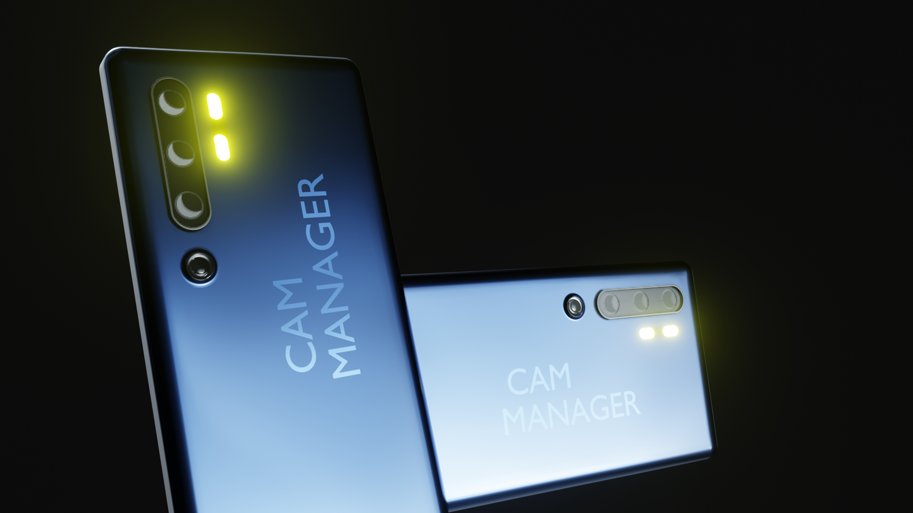

# Cam-Manager

Cam-Manager is an add-on to improve efficiency and organization with multiple cameras. It empowers you to quickly present your work from product design to modeling/texturing work. It is a powerful tool to tweak the composition and framing of your artwork or when working with image planes. The addon includes different overview panels (3D view and Scene properties), a pie menu for quickly adjusting settings on the active camera, different tools to assign and adjust camera-specific resolution, world materials, render slots, and more. Further, it allows you to customize the shortcuts to your needs.
>⚠️
**This addon does not provide special tools for animation.** It is designed for static cameras, working with image planes, setting up the framing and composition as well as quickly presenting your work with static images.
## Getting the addon: 
Support me by purchasing the addon from [Blender Market](https://blendermarket.com/products/cam-manager). You are permitted to get a copy from this GitHub page and everything specified in the attached license (GPL 3.0). Creating addons is a lot of effort and work. The licensing and contribution of my future addons will also depend on the fairness of all of you.

The releases will also be published here on  [GitHub Releases](https://github.com/Weisl/Cam-Manager/releases). 

## Contribution
The best and easiest way to contribute is to share your experiences and use cases with me. Seeing how you work, helps me to understand what you need.

Pull requests are also very welcome. Feel free to contact me before working on your changes and making a pull request. Let's see if the proposed changes fit the overall design and purpose of this addon. I will be strict in keeping a consistent user experience and vision for this addon.
